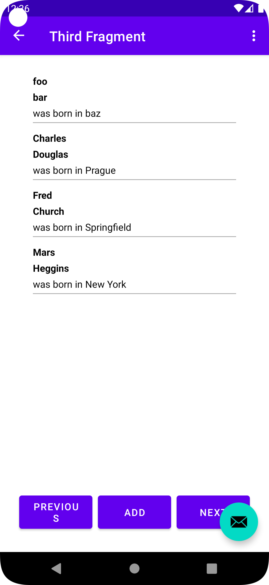

The data binding is already done from the beginning of the lab.

Fixed issues:

- [x] Data binding receiving null values
- [x] Calendar binding type issue
- [x] Passing data through fragments is not working
- [x] Intent crashes
- [ ] Navigation of `Add Fragment` if added new entry doesn't work

Could be improved:

- Move navigations to FAB
- Refactor structures e.g. make recycled view an entry point

To display the recycled view, step to the third fragment and use add button to add new person info.

